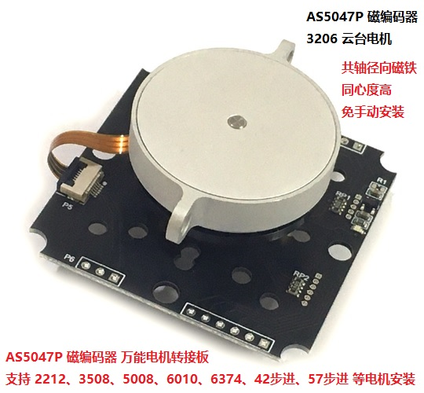
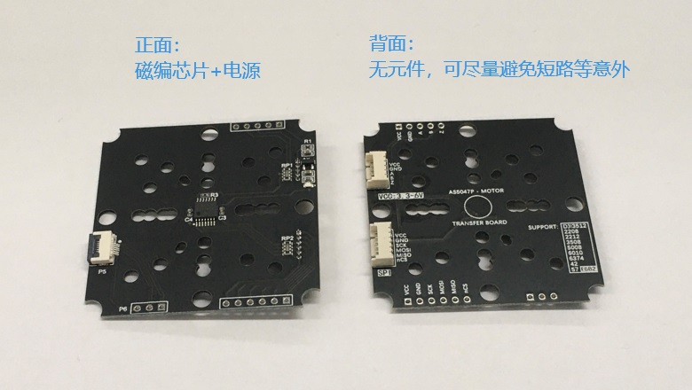
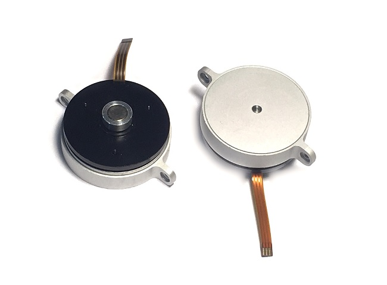
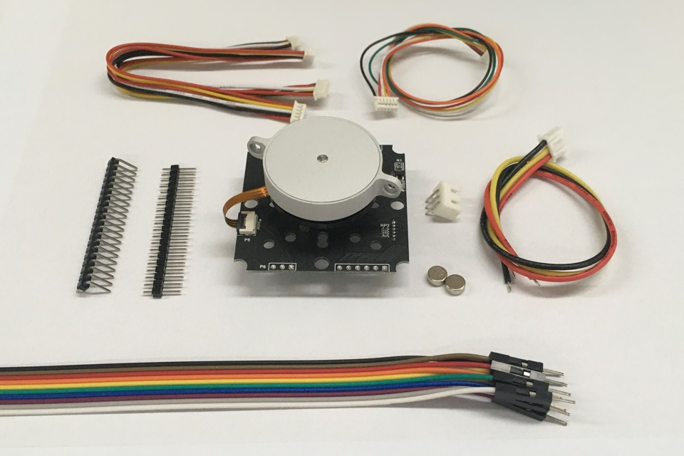

# AS5047P_Encoder

***
## AS5047P 磁编码器万能转接板资料
***

&emsp;&emsp;此为 **AS5047P 磁编码器万能转接板** 的资料下载页，内容包括 **原理图**、**BOM**（图形化，用浏览器打开）、**AS5047P数据手册**。

&emsp;&emsp;其中BOM可用浏览器打开，如要更改标准5V通信电平时，需改动板载的元件，方便定位器件位置。

&emsp;&emsp;因淘宝商品详情页的编辑功能比较鸡肋，手机和电脑不同步，而且容易吞链接，更多的介绍内容见我的博客和Github。

【功能简介】

- 板载高性能AS5047P磁编码器芯片，14 位绝对角度位置传感器。

- 最高支持转速 28000RPM，动态角度误差最大值约为 ±0.2° 。使用 AMS专利的 动态角度误差补偿 (DAEC™) 技术，系统延迟仅为2us。非常适合高速无刷电机的位置检测。

- 3.3~6V 电压输入。通信电平兼容 3.3/5.0V。可更改电阻连接以适配 3.3/5.0V 通信电平。

- 支持 2208、2212、2216、3508、3512、5008、6010、6374、42步进、57步进 等电机的安装。还兼容 欧姆龙E6B2 光电编码器的安装孔。

- 板载LDO供电，稳定可靠。

- 丝印标识清晰，引出 SPI、ABI 接口，提供 MX1.25、XH2.54 两种脚距的端口。

- 背面无阻容元件，极大概率防止短路等意外。

 

## 配套电机，淘宝购买链接

&emsp;&emsp;在售云台电机的轴底部，自带径向磁铁，同心度高，适合调试使用。电机磁极尺寸应该为3206。

&emsp;&emsp;淘宝购买链接，感谢支持：[AS5047P磁编码器万能转接板+3206云台电机](https://m.tb.cn/h.f9jDK1C?sm=46441a)

## 可安装电机，适配孔位，板型二维图

 

## MCU读磁极角度

&emsp;&emsp;如自己用`MCU`来读AS5047P的角度，代码可参考我的 [ESP32-EasyIO库](https://github.com/ZhiliangMa/easyio-lib-for-esp32)，其中的 `29_SPI_AS5047P` Demo。

[AS5047P磁编码器ESP32驱动程序、硬件电路设计、SPI通信时序、逻辑波形分析、注意事项](https://blog.csdn.net/Mark_md/article/details/119645201?ops_request_misc=%257B%2522request%255Fid%2522%253A%2522164166922716780261920995%2522%252C%2522scm%2522%253A%252220140713.130102334.pc%255Fblog.%2522%257D&request_id=164166922716780261920995&biz_id=0&utm_medium=distribute.pc_search_result.none-task-blog-2~blog~first_rank_ecpm_v1~rank_v31_ecpm-1-119645201.nonecase&utm_term=5047&spm=1018.2226.3001.4450)

 

## Odrive配置教程

见我的博客，里面有详细的图文教程，按照步骤复制粘贴配置项即可：

[ODrive踩坑（四）AS5047P-SPI绝对值磁编码器，不需每次上电校准无刷电机，直接上电可用](https://blog.csdn.net/Mark_md/article/details/119774663?ops_request_misc=%257B%2522request%255Fid%2522%253A%2522164161160716780274135519%2522%252C%2522scm%2522%253A%252220140713.130102334.pc%255Fblog.%2522%257D&request_id=164161160716780274135519&biz_id=0&utm_medium=distribute.pc_search_result.none-task-blog-2~blog~first_rank_ecpm_v1~rank_v31_ecpm-1-119774663.nonecase&utm_term=odrive&spm=1018.2226.3001.4450)

[ODrive踩坑（五）ODrive驱动3206云台电机、低齿槽转矩电机实现高精度定位](https://blog.csdn.net/Mark_md/article/details/119860059?ops_request_misc=%257B%2522request%255Fid%2522%253A%2522164161160716780274135519%2522%252C%2522scm%2522%253A%252220140713.130102334.pc%255Fblog.%2522%257D&request_id=164161160716780274135519&biz_id=0&utm_medium=distribute.pc_search_result.none-task-blog-2~blog~first_rank_ecpm_v1~rank_v31_ecpm-5-119860059.nonecase&utm_term=odrive&spm=1018.2226.3001.4450)

[AS5047P磁编码器ESP32驱动程序、硬件电路设计、SPI通信时序、逻辑波形分析、注意事项](https://blog.csdn.net/Mark_md/article/details/119645201?ops_request_misc=%257B%2522request%255Fid%2522%253A%2522164166922716780261920995%2522%252C%2522scm%2522%253A%252220140713.130102334.pc%255Fblog.%2522%257D&request_id=164166922716780261920995&biz_id=0&utm_medium=distribute.pc_search_result.none-task-blog-2~blog~first_rank_ecpm_v1~rank_v31_ecpm-1-119645201.nonecase&utm_term=5047&spm=1018.2226.3001.4450)

